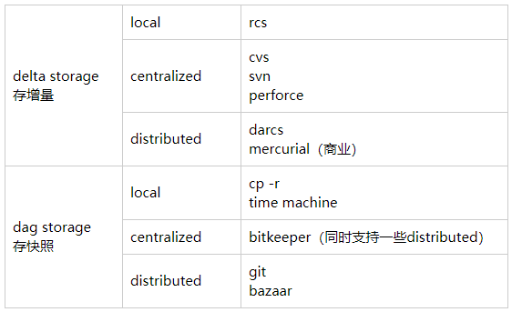
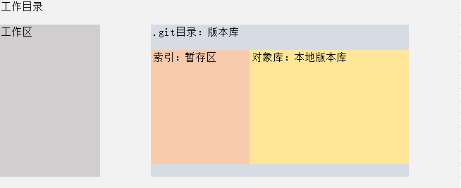

什么是Git

- distributed version control system（分布式版本控制系统）
- no subversion（它不是svn版本控制系统）
- Directory content management system（目录内容管理系统）
- The tree history storage system（树状的历史存储系统）
- The stupid content tracker（傻瓜式的内容追踪器）
- A toolkit（工具箱）

不同版本控制系统使用的存储方式以及各自支持的管理方式

- 分布式的版本控制系统：每个人的电脑就是一个仓库。先写到本地的仓库，然后推到网上的仓库。即便网上的仓库崩了，本地也有，反之亦然。Git就是这种实现
- 集中式版本控制系统：必须通过网络连接到中心服务器，无法直接在本地更改。SVN就是这种实现

仓库结构

创建仓库就相当于创建一个目录，目录的名字就是仓库的名字，目录也叫作工作目录。工作目录下面有一个隐藏目录.git，仓库的内容都存放在.git目录中。

工作目录中有三个区域：工作区：暂存区、对象库。其中暂存区和对象库都存储在.git目录中。

- 工作区：其实就是工作目录下面，.git目录外的地方。存储用户新建内容或者编辑的文件。

- 暂存区：存储的是追踪但尚未提交的文件，以及工作目录中的路径结构

- 对象库：存储对象文件（blob、tree、commit、tag）

