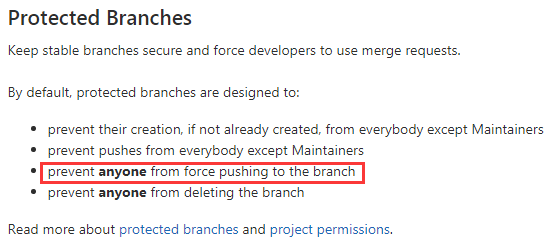
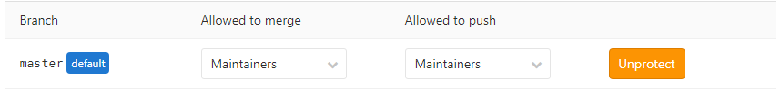

# CE or EE

它们的许可模型不一样。CE是开源的，使用MIT Expat license。EE是是基于CE的，它使用了与CE的一些相同核心，但在此之上添加了一些额外的特性和功能。这是在专有许可下的。

- 使用EE版本：如果有许可你就可以体验到EE的特性。如果你没有许可，你仅可以使用到MIT许可的功能。这意味着如果你安装了EE但是没有许可，你不会发现和典型的CE有什么不同，但是还有其他优点：
  - 如果你想体验EE的特性，你无需升级或设置一个新的实例。你在Gitlab上启用使用试用版即可。如果你对EE的特性不满意，在试用期结束后他会自动恢复为仅Community Edition功能。
  - 从CE升级到EE，你必须确保您使用的是同一版本，并按照特定的步骤进行，这通常需要停机。使用EE版本的话，只需要要CE和完整的EE功能之间做切换即可。

- 使用CE版本：不包含特殊的代码。功能上它和没有许可的EE版本是一样的。如果你想要升级到EE版本，会有停机时间。


# GitLab Installation on Centos7

强烈建议下载Omnibus软件包安装程序，因为它安装速度更快，升级更容易，并且包含增强其他方法所没有的可靠性的功能。强烈建议在至少有4GB的可用RAM的机器上运行GitLab。

安装必要的依赖，并在防火墙上打开80和443端口

```bash
$ yum install -y curl policycoreutils-python openssh-server
sudo systemctl enable sshd
sudo systemctl start sshd
sudo firewall-cmd --permanent --add-service=http
sudo firewall-cmd --permanent --add-service=https
sudo systemctl reload firewalld
```


安装Postfix来发送通知邮件。如果你有其他外部解决方案可以跳过这步

```bash
$ yum install postfix
$ systemctl enable postfix
$ systemctl start postfix
```


添加Gitlab的repo并安装它

```BASH
$ curl https://packages.gitlab.com/install/repositories/gitlab/gitlab-ee/script.rpm.sh | sudo bash
```


安装Gitlab包，更改https://gitlab-netadm.leju.com为你将要用来访问Gitlab实例的URL。安装时将会自动配置并使用这个URL启动Gitlab

如果指定一个https://的URL将会自动使用Let's Encrypt请求证书。你也可以[使用自己的证书](https://docs.gitlab.com/omnibus/settings/nginx.html#manually-configuring-https)或指定为http://的URL

```bash
$ sudo EXTERNAL_URL="https://gitlab-netadm.leju.com" yum install -y gitlab-ee
```

安装完之后，你的第一次访问，将被重定向到密码重置页面。你输入了初始管理员密码之后你将重定向到登录页面。使用默认的账户名root+初始密码进行登录。


因为我们内部有统一的nginx反代做SSL终结，所以Gitlab上不需要SSL，启用http即可。

默认情况下如果external_url包含了https://，Gitlab的nginx将自动检测是否使用SSL。如果你的Gitlab在反代之后运行，你可能希望在反代上终结SSL。为此，请确保external_url包含https://并将以下配置应用于gitlab.rb：

```BASH
nginx['listen_port'] = 80
nginx['listen_https'] = false
```

其他的捆绑组将 (Registry, Pages, etc)使用对代理SSL使用类似的策略。使用https://设置特定组件的`* _external_url`，并在nginx [...]配置前添加组件名称。例如，对于Registry，请使用以下配置：

```BASH
registry_external_url 'https://registry.example.com'
registry_nginx['listen_port'] = 80
registry_nginx['listen_https'] = false
```

# 实例1：有统一的反代来终结SSL，Gitlab以http方式运行

**更改gitlab的配置文件**

```BASH
[10.208.3.20 root@test-3:~]# cat /etc/gitlab/gitlab.rb
external_url 'https://gitlab-netadm.leju.com'
nginx['enable'] = true
nginx['redirect_http_to_https']=false
letsencrypt['enable'] = false
nginx['listen_addresses'] = ["0.0.0.0", "[::]"]
nginx['listen_port'] = 80
nginx['listen_https'] = false
nginx['gzip_enabled'] = false
nginx['real_ip_trusted_addresses'] = [ '10.208.3.0/24' ]
nginx['real_ip_header'] = 'X-Real-IP'
nginx['real_ip_recursive'] = 'off'
nginx['log_format'] = '$remote_addr [$time_local] "$request" $status $body_bytes_sent "$http_referer" "$http_user_agent" "$http_x_forwarded_for"'
##gitlab的web页面上，SSH方式克隆链接中的主机名或IP。
gitlab_rails['gitlab_ssh_host'] = 'gitlab-netadm.leju.com'
##指定更改这个并不会更改服务器上的SSH端口，更改的是gitlab的web页面上，SSH方式克隆链接中的端口。因为我有统一的反代，所以使用默认的22会直接连接到反代的SSH端口上，导致无法执行git操作，我在这里更改端口之后，在反代上配置四层代理，问题就解决了。更改这个配置并不会导致服务器的监听2223，还是使用sshd进程监听的端口。我在下面的反代配置中，upstream服务器的端口还是22，只不过反代监听2223。
gitlab_rails['gitlab_shell_ssh_port'] = 2223
gitlab_rails['gitlab_shell_git_timeout'] = 800
```

**使新配置生效**

```BASH
[10.208.3.20 root@test-3:~]# gitlab-ctl stop
[10.208.3.20 root@test-3:~]# gitlab-ctl reconfigure
[10.208.3.20 root@test-3:~]# gitlab-ctl start
```

**外部nginx反代设置**

```BASH
stream {
    log_format proxy '$remote_addr [$time_local] '
                     '$protocol $status $bytes_sent $bytes_received '
                     '$session_time "$upstream_addr" '
                     '"$upstream_bytes_sent" "$upstream_bytes_received" "$upstream_connect_time"';
    access_log /usr/local/nginx/logs/port_proxy_access.log proxy buffer=32k flush=1s;
    server {
        listen 2223;
        proxy_connect_timeout 5s;
        proxy_timeout 30s;
        proxy_pass 10.208.3.20:22;
    }
}
http {
    include       mime.types;
    default_type  application/octet-stream;

    log_format  main  '$remote_addr - $remote_user [$time_local] "$request" '
                      '$status $body_bytes_sent "$http_referer" '
                      '"$http_user_agent" "$http_x_forwarded_for"';
    sendfile        on;
    keepalive_timeout  65;
    gzip  on;
    gzip_comp_level 9;
    gzip_min_length 1k;
    gzip_types text/plain application/xml text/css text/js text/xml application/x-javascript text/javascript application/json application/xml+rssi application/javascript;
    gzip_vary on;
    gzip_disable "MSIE [1-6]\.";
    gzip_buffers  16 8k;
    more_clear_headers 'Server';
    server_tokens       off;
###############################################################################
###############################################################################
###############################################################################
    upstream gitlab_server {
        server 10.208.3.20:80;
        keepalive 16;
    }
    server {
        listen 80;
        server_name gitlab-netadm.leju.com;
        rewrite ^(.*) https://$host$1 permanent;
    }
    server {
        listen 443 ssl;
        server_name gitlab-netadm.leju.com;
        ssl_certificate /etc/certs/xing.leju.com.pem;
        ssl_certificate_key /etc/certs/xing.leju.com.key;
        ssl_protocols TLSv1 TLSv1.1 TLSv1.2;
        ssl_session_cache shared:SSL_SESSION:10M;
        ssl_session_timeout 5m;
        ssl_ciphers  HIGH:!aNULL:!MD5;
        location / {
            proxy_pass http://gitlab_server;
            proxy_next_upstream_timeout 60;
            proxy_buffering off;
            proxy_request_buffering off;
            proxy_http_version 1.1;
            proxy_set_header Connection "";
            proxy_set_header Host $host;
            proxy_set_header X-Real-IP $remote_addr;
            proxy_set_header X-Forwarded-For $proxy_add_x_forwarded_for;
        }
    }
```

**测试SSH推拉**

```BASH
[10.208.3.23 root@test-5:/tmp]# git clone ssh://git@gitlab-netadm.leju.com:2223/root/testapp.git
Cloning into 'testapp'...
remote: Enumerating objects: 3, done.
remote: Counting objects: 100% (3/3), done.
remote: Total 3 (delta 0), reused 0 (delta 0), pack-reused 0
Receiving objects: 100% (3/3), done.
[10.208.3.23 root@test-5:/tmp/testapp]# cp /etc/hosts ./
[10.208.3.23 root@test-5:/tmp/testapp]# git add  .
[10.208.3.23 root@test-5:/tmp/testapp]# git commit -am "test"
[10.208.3.23 root@test-5:/tmp/testapp]# git push origin master 
Counting objects: 4, done.
Delta compression using up to 2 threads.
Compressing objects: 100% (3/3), done.
Writing objects: 100% (3/3), 354 bytes | 0 bytes/s, done.
Total 3 (delta 0), reused 0 (delta 0)
To ssh://git@gitlab-netadm.leju.com:2223/root/testapp.git
   3f9bdb8..7d6603b  master -> master
```

**测试HTTP推拉**

```BASH
[10.208.3.23 root@test-5:/tmp]# git clone https://gitlab-netadm.leju.com/root/testapp.git testapp2
Cloning into 'testapp2'...
Username for 'https://gitlab-netadm.leju.com': root
Password for 'https://root@gitlab-netadm.leju.com': 
remote: Enumerating objects: 6, done.
remote: Counting objects: 100% (6/6), done.
remote: Compressing objects: 100% (4/4), done.
remote: Total 6 (delta 0), reused 0 (delta 0), pack-reused 0
Unpacking objects: 100% (6/6), done.
[10.208.3.23 root@test-5:/tmp]# cd testapp2
[10.208.3.23 root@test-5:/tmp/testapp2]# cp /etc/issue ./
[10.208.3.23 root@test-5:/tmp/testapp2]# git add  .
[10.208.3.23 root@test-5:/tmp/testapp2]# git commit -am "test2"
[master c7d3319] test2
 1 file changed, 3 insertions(+)
 create mode 100644 issue
[10.208.3.23 root@test-5:/tmp/testapp2]# git push origin master 
Username for 'https://gitlab-netadm.leju.com': root
Password for 'https://root@gitlab-netadm.leju.com': 
Counting objects: 4, done.
Delta compression using up to 2 threads.
Compressing objects: 100% (2/2), done.
Writing objects: 100% (3/3), 316 bytes | 0 bytes/s, done.
Total 3 (delta 0), reused 0 (delta 0)
To https://gitlab-netadm.leju.com/root/testapp.git
   7d6603b..c7d3319  master -> master
```


# 实例2：没有统一的反代来终结SSL，Gitlab以https对外提供服务

```BASH
[10.208.3.20 root@test-3:~]# cat /etc/gitlab/gitlab.rb
external_url 'https://gitlab-netadm.leju.com'
nginx['enable'] = true
nginx['gzip_enabled'] = true
nginx['listen_https'] = true
nginx['redirect_http_to_https']=false
nginx['ssl_certificate'] = "/etc/gitlab/ssl/xing.leju.com.pem"
nginx['ssl_certificate_key'] = "/etc/gitlab/ssl/xing.leju.com.key"
nginx['real_ip_trusted_addresses'] = [ '10.208.3.0/24' ]
nginx['real_ip_header'] = 'X-Real-IP'
nginx['real_ip_recursive'] = 'off'
nginx['log_format'] = '$remote_addr [$time_local] "$request" $status $body_bytes_sent "$http_referer" "$http_user_agent" "$http_x_forwarded_for"'
```

# FQA

**项目维护者强制PUSH报错: ”remote: GitLab: You are not allowed to force push code to a protected branch on this project.“**

```BASH
[10.208.3.23 root@test-5:/tmp/Git2]# git push --force origin master 
Username for 'https://gitlab-netadm.leju.com': root
Password for 'https://root@gitlab-netadm.leju.com': 
Counting objects: 9, done.
Delta compression using up to 2 threads.
Compressing objects: 100% (6/6), done.
Writing objects: 100% (9/9), 824 bytes | 0 bytes/s, done.
Total 9 (delta 0), reused 0 (delta 0)
remote: GitLab: You are not allowed to force push code to a protected branch on this project.
To https://gitlab-netadm.leju.com/root/Git.git
 ! [remote rejected] master -> master (pre-receive hook declined)
error: failed to push some refs to 'https://gitlab-netadm.leju.com/root/Git.git'
```

这是因为master分支默认开启了Protected Branches，此功能禁止任何人强制PUSH。所以想要强制PUSH只能在此分支上关掉此功能。

进入项目gitlab网页版---进入项目---点击settings---点击Repository---找到Protected Branches---把在master分支的条目上点击unprotecte






**项目维护者执行PUSH报错: ”error: RPC failed; HTTP 413 curl 22 The requested URL returned error: 413“**

```BASH
$ git push Gitlab-Git master
Enumerating objects: 66, done.
Counting objects: 100% (66/66), done.
Delta compression using up to 4 threads
Compressing objects: 100% (66/66), done.
error: RPC failed; HTTP 413 curl 22 The requested URL returned error: 413
fatal: the remote end hung up unexpectedly
Writing objects: 100% (66/66), 3.36 MiB | 6.56 MiB/s, done.
Total 66 (delta 15), reused 0 (delta 0), pack-reused 0
fatal: the remote end hung up unexpectedly
Everything up-to-date
```

这是因为该分支的大小超过了nginx（也有可能是其他应用）中设置的客户端request body的最大大小。

解决方法是在nginx配置文件中上gitlab的server块中增加下面这条配置：

```BASH
client_max_body_size 30M;
```

