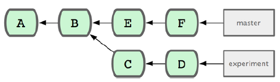

推送自己的featureB，到orgion的FeatureBee分支中

```bash
$ git push origin featureB:featureBee
```

此为refspec


以当前maste分支为基础，创建临时分支

```bash
$ git branch sc/ruby_client master
```


以当前maste分支为基础，创建临时分支，并立即转到分支上工作

```bash
$ git branch -b sc/ruby_client master
```


如果收到的补丁文件是用git diff 或由其它Unix 的diff 命令生成，就该用git apply 命令来应用补丁。假

```bash
$ git apply /tmp/patch-ruby-client.patch
```


git apply 是一个事务性操作的命令，也就是说，要么所有补丁都打上去，要么全部放弃。所以不会出现
patch 命令那样，一部分文件打上了补丁而另一部分却没有，这样一种不上不下的修订状态。


在实际打补丁之前，可以先用git apply --check 查看补丁是否能够干净顺利地应用到当前分支中，如果没有任何输出，表示我们可以顺利采纳该补丁。：

```bash
$ git apply --check 0001-seeing-if-this-helps-the-gem.patch
```


添加远端分支，并用fetch到的远端仓库的某个分支，创建一个新分支

```bash
$ git remote add jessica git://github.com/jessica/myproject.git
$ git fetch jessica
$ git checkout -b rubyclient jessica/ruby-client
```


查看本次提交改动了什么

```BASH
[10.208.3.20 root@test-3:~/testapp]# git show 4a2c1f59c8d4cc7c14c250974c1431015dad1965
commit 4a2c1f59c8d4cc7c14c250974c1431015dad1965
Author: tianbao3 <tianbao1@example.com>
Date:   Thu Apr 16 11:45:45 2020 +0800

    0.3.4

diff --git a/issue2 b/issue2
index 6736cb1..9daeafb 100644
--- a/issue2
+++ b/issue2
@@ -1,3 +1 @@
-\S
-Kernel \r on an \m
-
+test
```


# 祖先引用

**^查看父提交**

查看当前提交的父提交

git show HEAD^


**^2查看第二父提交**

这种语法只在合并提交时有用，因为合并提交可能有多个父提交。第一父提交是你合并时所
在分支，而第二父提交是你所合并的分支：


**另外一个指明祖先提交的方法是~**

这也是指向第一父提交，所以HEAD~ 和HEADˆ 是等价的。

当你指定数字的时候就明显不一样了。HEAD~2 是指“第一父提交的第一父提交”，也就是“祖父提交”。


HEAD~3也可以写成HEADˆˆˆ，同样都表示第一父提交的第一父提交的第一父提交：


混合使用

HEAD~3^2：第一父提交的第一父提交的第一父提交的第二父提交


# 提交范围

双点

最常用的指明范围的方法是双点的语法。这种语法主要是让Git 区分出可从一个分支中获得而不能从另一个分支中获得的提交。



查看试验分支上哪些没有被提交到主分支（查看experiment上有，但master上没有的提交）

```bash
$ git log HEAD..experiment
```

git log ..experiment和上面的命令是一个效果，git会使用HEAD代替不存在的一边。


多点

你也许会想针对两个以上的分支来指明修订版本，比如查看哪些提交被包含在某些分支中的一个，但是不在你当前的分支上。Git允许你在引用前使用ˆ字符或者--not指明你不希望提交被包含其中的分支。因此下面三个命令是等同的：

```bash
$ git log refA..refB
$ git log ^refA refB
$ git log refB --not refA
```

这样很好，因为它允许你在查询中指定多于两个的引用，而这是双点语法所做不到的。如果你想查找所有从refA或refB包含的但是不被refC包含的提交，你可以输入下面中的一个

```BASH
$ git log refA refB ^refC
$ git log refA refB --not refC
```


三点

这个可以指定被两个引用中的一个包含但又不被两者同时包含的分支。

如果你想查看master或者experiment中包含的但不是两者共有的引用，你可以运行

```BASH
$ git log master...experiment
F
E
D
C
```

这个再次给出你普通的log输出但是只显示那四次提交的信息，按照传统的提交日期排列。
这种情形下，log命令的一个常用参数是--left-right，它会显示每个提交到底处于哪一侧的分支。这使得数据更加有用。

```bash
$ git log --left-right master...experiment
< F
< E
> D
> C
```


# 储藏（Stashing）

经常有这样的事情发生，当你正在进行项目中某一部分的工作，里面的东西处于一个比较杂乱的状态，而你想转到其他分支上进行一些工作。问题是，你不想提交进行了一半的工作，否则以后你无法回到这个工作点。解决这个问题的办法就是git stash命令。“‘储藏”“可以获取你工作目录的中间状态（也就是你修改过的被追踪的文件和暂存的变更），并将它保存到一个未完结变更的堆栈中，随时可以重新应用。

注意：

- 如果在执行恢复的时候，不指定要恢复的储藏的名字，则默认使用最近的一个储藏。
- 每个储藏都有一个名字，名字里有索引（stash@{0}、stash@{1}、stash@{2}）。每次新创建的储藏都为stash@{0}，旧储藏的索引都会+1。
- 恢复储藏的工作目录是干净的（执行git status显示没改动），并且属于同一分支；但是一个干净的工作目录和应用到相同的分支的要求并不是恢复储藏的必要条件。你可以在其中一个分支上保留一份储藏，随后切换到另外一个分支，再重新恢复这些变更。在工作目录里包含已修改和未提交的文件时，你也可以恢复储藏，但如果有任何变更无法被应用（如果现在更改的一个文件，在储藏中也更改了），则Git会该出归并冲突

**示例**

更改完文件之后，储藏工作状态（储藏之后，git status显示没有任何更改）

```bash
[10.208.3.20 root@test-3:~/testapp]# git status
# On branch master
# Changes to be committed:
#   (use "git reset HEAD <file>..." to unstage)
#
#	modified:   issue2
#
# Changes not staged for commit:
#   (use "git add <file>..." to update what will be committed)
#   (use "git checkout -- <file>..." to discard changes in working directory)
#
#	modified:   issue2
#
[10.208.3.20 root@test-3:~/testapp]# git stash
Saved working directory and index state WIP on master: cec3c1d 0.3.7
HEAD is now at cec3c1d 0.3.7
[10.208.3.20 root@test-3:~/testapp]# git status
# On branch master
nothing to commit, working directory clean
```

重新更改这个文件，然后继续储藏工作状态

```bash
[10.208.3.20 root@test-3:~/testapp]# echo hello9999 >> issue2 
[10.208.3.20 root@test-3:~/testapp]# git add .
[10.208.3.20 root@test-3:~/testapp]# git status
# On branch master
# Changes to be committed:
#   (use "git reset HEAD <file>..." to unstage)
#
#	modified:   issue2
#
[10.208.3.20 root@test-3:~/testapp]# git stash
Saved working directory and index state WIP on master: cec3c1d 0.3.7
HEAD is now at cec3c1d 0.3.7
```

查看储藏列表

```bash
[10.208.3.20 root@test-3:~/testapp]# git stash list
stash@{0}: WIP on master: cec3c1d 0.3.7
stash@{1}: WIP on master: cec3c1d 0.3.7
```

恢复最开始的那个储藏

```bash
##发现暂存区中的内容没有恢复，只是将工作目录恢复了。这是因为只有在执行恢复的时候指定--index，才会恢复暂存区的内容。因此我们执行git reset回到上次commit的状态
[10.208.3.20 root@test-3:~/testapp]# git stash apply stash@{1}
# On branch master
# Changes not staged for commit:
#   (use "git add <file>..." to update what will be committed)
#   (use "git checkout -- <file>..." to discard changes in working directory)
#
#	modified:   issue2
#
no changes added to commit (use "git add" and/or "git commit -a")
[10.208.3.20 root@test-3:~/testapp]# cat .git/refs/heads/master 
cec3c1d079b8a9c0f5f68136df4249d6522f58d1
[10.208.3.20 root@test-3:~/testapp]# git reset --hard cec3c1d079b8a9c0f5f68136df4249d6522f58d1
HEAD is now at cec3c1d 0.3.7
```

使用--index重新恢复储藏，状态成功恢复

```bash
[10.208.3.20 root@test-3:~/testapp]# git stash apply --index  stash@{1}
# On branch master
# Changes to be committed:
#   (use "git reset HEAD <file>..." to unstage)
#
#	modified:   issue2
#
# Changes not staged for commit:
#   (use "git add <file>..." to update what will be committed)
#   (use "git checkout -- <file>..." to discard changes in working directory)
#
#	modified:   issue2
#
```

删除储藏

```BASH
[10.208.3.20 root@test-3:~/testapp]# git stash drop stash@{0}
Dropped stash@{0} (1c79b8ff4dbdfeddcfe30950113a6856b64dcbf5)
[10.208.3.20 root@test-3:~/testapp]# git stash list
stash@{0}: WIP on master: cec3c1d 0.3.7
```

也可以使用git stash pop在恢复储藏成功之后，自动且将其从堆栈中移除（恢复失败不会移除）

```BASH
[10.208.3.20 root@test-3:~/testapp]# git stash list
stash@{0}: WIP on master: cec3c1d 0.3.7
[10.208.3.20 root@test-3:~/testapp]# git stash pop --index  stash@{0}
# On branch master
# Changes to be committed:
#   (use "git reset HEAD <file>..." to unstage)
#
#	modified:   issue2
#
# Changes not staged for commit:
#   (use "git add <file>..." to update what will be committed)
#   (use "git checkout -- <file>..." to discard changes in working directory)
#
#	modified:   issue2
#
Dropped stash@{0} (ad34fd58099384eb9ab0997324abb67c687b21fd)
[10.208.3.20 root@test-3:~/testapp]# git stash list
没有显示了，成功移除
```

使用储藏创建分支

这会检出储藏工作时所处的提交，并应用储藏中的工作，如果成功，则会丢弃储藏。

使用储藏stash@{0}创建一个叫做testchanges2的分支

```BASH
[10.208.3.20 root@test-3:~/testapp]# git stash branch testchanges2 stash@{0}
Switched to a new branch 'testchanges2'
# On branch testchanges2
# Changes to be committed:
#   (use "git reset HEAD <file>..." to unstage)
#
#	modified:   issue2
#
# Changes not staged for commit:
#   (use "git add <file>..." to update what will be committed)
#   (use "git checkout -- <file>..." to discard changes in working directory)
#
#	modified:   issue2
#
Dropped stash@{0} (7e65b261c3205dc3f2d5775c52a176634445ff61)
```

